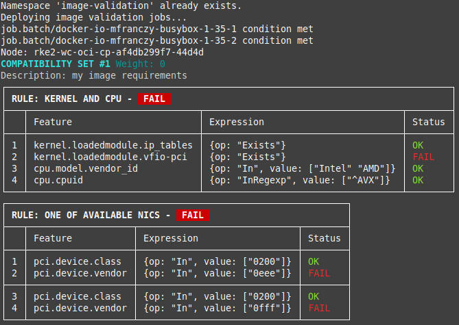

# Image Validation Script

This script automates the validation of container images across Kubernetes nodes by creating and managing Kubernetes jobs.
Fetches and displays the logs for each completed job, showing the results of the validation.

## Prerequisites

- A Kubernetes cluster with the `kubectl` command-line tool configured.
- Sufficient permissions to create namespaces, jobs, and delete resources in the `image-validation` namespace.

## Usage

```bash
./validate.sh <image> [<nodes>]
```

### Arguments

- `<image>`: The container image to validate. This argument is required.
- `<nodes>`: (Optional) A space-separated list of Kubernetes nodes where the validation jobs will run. If omitted, all nodes in the cluster are used.

### Examples

1. **Validate an Image on All Nodes**:
   ```bash
   ./validate.sh my-repo/my-image:latest
   ```

2. **Validate an Image on Specific Nodes**:
   ```bash
   ./validate.sh my-repo/my-image:latest "node1 node2"

## Notes

- **Error Handling**:
  - The script uses `set -e` to exit on errors, except where explicitly allowed (e.g., deleting non-existent jobs).
  
- **Namespace Creation**:
  - The script ensures the `image-validation` namespace exists before running jobs. If it does not exist, the namespace is created automatically.

- **Output Control**:
  - Job creation and deletion logs are hidden. Only the results of the validation are displayed.

## Example output



## Customization

- Update the `image-validation-job.template` file to customize the job definition. Ensure placeholders `{{IMAGE}}`, `{{NODE_NAME}}`, and `{{JOB_NAME}}` are present.

## Troubleshooting

- If the script fails, check:
  - The `kubectl` context and permissions.
  - The `image-validation-job.template` file format.
  - The status of the `image-validation` namespace and jobs.
